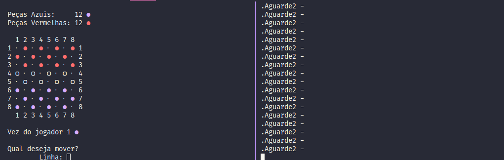

# Damas multijogador via driver

Jogo de damas para 2 jogadores simultaneos, feito via kernel do linux.  

<h3>Como executar...</h3>
<strong>Comandos para carregar o driver:</strong>  
1. sudo mknod /dev/so c 60 0  
2. sudo chmod 666 /dev/so  
3. make  
4. sudo insmod driver.ko  
 
<strong>Comandos para carregar o jogo:</strong>  
1. gcc -o damas damas.c  
2. ./damas  

<strong>Para reiniciar o driver:</strong>
1. ./comand.sh
 

<h3>Terminal</h3>

